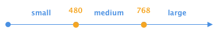
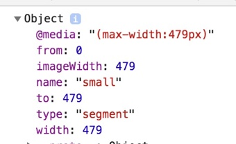
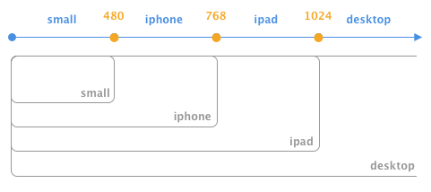

# Breakpoint X (Crossing)

## Summary

Define responsive breakpoints, which can fire JS callbacks; optionally apply CSS classes to designated elements.

This zero-dependency project provides a means to define points along the horizontal axis of the window, breakpoints, which can fire JS callbacks when the width crosses those breakpoints.  It provides a setting, which will apply CSS classes to designated elements.  It provides a PHP class with a similar form, that can be useful if you're using, say, a CMS for coordinating breakpoints.

A breakpoint is defined as a single point along the horizontal axis.  To the left lies a segment, and to the right of the highest value breakpoint lies the ray.  To the right of all but the highest value breakpoint, likes a segment.  See the section below _Breakpoint Theory_.

**Visit <http://www.intheloftstudios.com/packages/js/breakpointx> for full documentation.**

## Installation

Install using `yarn add @aklump/breakpointx` or `npm i @aklump/breakpointx`

## Quick Start

    var bp = new BreakpointX([480, 768]);

Get segment info using any point along the axis:

    bp.getSegment(200);
    bp.getSegment(480);
    bp.getSegment(1000);

### Named Segments

It can be helpful to name your segments:

    var obj = new BreakpointX([480, 768], ['small', 'medium', 'large']);

Then you can also retrieve segment info using a name, which includes items such as the width, from point, to point, media query, image width, name, and more.

    bp.getSegment(300);
    bp.getSegment('small');
    
    var name = bp.getSegment('small').name;
    var query = bp.getSegment('small')['@media'];
    var imageWidth = bp.getSegment(300).imageWidth;

## CSS Classes

To cause CSS classes to be written on an element, pass the appropriate settings, where `addClassesTo` is a DOM object.  It becomes a property of the instance as `.el`, so it can be accessed in callbacks, if necessary.  The example shows adding classes to the `html` element.  If you're using jQuery you could do `addClassesTo: $('html').get(0)`.

    // Breakpoints only with settings.
    var obj = new BreakpointX([768], ['mobile', 'desktop'], {
      addClassesTo: document.documentElement,
      classPrefix: 'bpx-',
    });

The element will look like this when the browser gets larger and crosses 768px.

    <html class="bpx-desktop bpx-bigger">

Or when crossing 768px getting smaller.

    <html class="bpx-mobile bpx-smaller">

## Callbacks When Breakpoints Are Crossed

When the window width changes, and a breakpoint is hit or crossed, callbacks can be registered to fire as a result. `this` points to the BreakpointX instance.

    // When the window crosses any breakpoint in either direction
    bp.addCrossAction(function(segment, direction, breakpoint, previousSegment) {
      ... do something in response.
    });

    // When the window crosses 768 in either direction
    bp.addBreakpointCrossAction(function(segment, direction, breakpoint, previousSegment) {
      ... do something in response.
    });

    // When the window crosses 768 getting smaller
    bp.addBreakpointCrossSmallerAction(768, function (segment, direction, breakpoint, previousSegment) {
      ... do something in response.
    });

    // When the window crosses 768 getting bigger
    bp.addBreakpointCrossBiggerAction(768, function (segment, direction, breakpoint, previousSegment) {
      ... do something in response.
    });

## In Terms of Devices

Here is an example which demonstrates how you might construct an instance when thinking in terms of physical devices.  It's given in PHP, however the JS methods are exactly the same.

    <?php
    $obj = new BreakpointX();
    $obj
      ->addDevice('iphone', 480)
      ->addDevice('ipad', 768)
      ->addDevice('desktop', 1024)
      ->renameSegment(0, 'small');

## In terms of Media Queries

You can also generate an object if you have a list of media queries representing the segments and ray.  The queries do not need to be in any specific order:

    var obj = new BreakpointX();
    obj
      .addSegmentByMedia('(max-width:768px)') // This is the ray.
      .addSegmentByMedia('(min-width:480px) and (max-width:767px)')
      .addSegmentByMedia('(max-width:479px)');

## PHP Usage

While this is foremost a Javascript project, there is a PHP class that may be helpful to your use case.  Browser-related methods do not exist, but other methods share the same API as the JS object.  The class file is _dist/BreakpointX.php_ or if installing with Node, _node_modules/@aklump/breakpointx/dist/BreakpointX.php_.

    <?php
    $bp = new BreakpointX([480, 768]);
    
    $name = $bp->getSegment(300)['name'];
    $query = $bp->getSegment(300)['@media'];
    $imageWidth = $bp->getSegment(300)['imageWidth'];

### Autoloading

 For PSR autoloading, the namespace `AKlump\\BreakpointX` should map to _node_modules/@aklump/breakpointx/dist_.  Here's an example for a _composer.json_ in the same directory as the _package.json_ used to install BreakpointX.

    {
        "autoload": {
            "psr-4": {
                "AKlump\\BreakpointX\\": "node_modules/@aklump/breakpointx/dist"
            }
        }
    }

## Contributing

If you find this project useful... please consider [making a donation](https://www.paypal.com/cgi-bin/webscr?cmd=_s-xclick&hosted_button_id=4E5KZHDQCEUV8&item_name=Gratitude%20for%20aklump%2Fbreakpoint_x).

## Breakpoint Theory

This cheatsheet will familiarize you with the terms used in this project.

Download this [Cheatsheet](docs/images/breakpoint-cheatsheet.pdf) by [In the Loft Studios](http://www.intheloftstudios.com)

### Common Mistakes

* By definition a _breakpoint_ does not have a width, nor does it have a minimum or a maximum; it's just a point.
* A CSS media query represents a _segment_ or _ray_ not a _breakpoint_.
